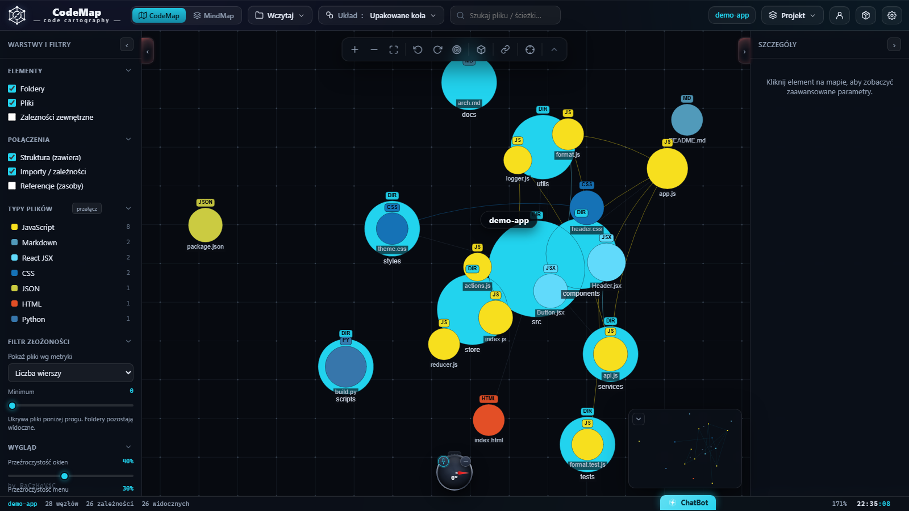

# CodeMap — Kartografia Kodu 🗺️

[](LICENSE)
[](https://github.com/RaCzKoViC/CodeMap/releases)
[](https://github.com/RaCzKoViC/CodeMap/actions/workflows/deploy-pages.yml)
[](#-architektura)

> **English summary.** CodeMap is a local-first, Maltego-style code cartography tool: load a folder,
> an archive or a GitHub/GitLab/Bitbucket repository and get an interactive map of files, dependencies
> and metrics — with 13 layouts, static analysis (15 anti-pattern rules), snapshots and diffs, a MindMap
> mode with a drawing layer, and optional AI assistants that can run **entirely in your browser**
> (WebLLM) or on your machine (Ollama). Pure JavaScript, no build step, PWA, MIT. UI in Polish and English.

**Demo online:** https://raczkovic.github.io/CodeMap/#demo



---

## 🚀 Start w 30 sekund

```bash
git clone https://github.com/RaCzKoViC/CodeMap.git
cd CodeMap
python serve.py            # → http://localhost:8777
```

Bez Pythona wystarczy dowolny serwer statyczny (`npx serve .`) albo dwuklik na `index.html`
(tryb `file://` ma ograniczenia: brak service workera i migawek w IndexedDB).
Kliknij **„✨ Zobacz demo"** lub otwórz `index.html#demo`.

---

## ✨ Co potrafi

### Wczytywanie (150+ formatów)
- **Folder / pliki / przeciągnij-upuść / wklej** (`Ctrl+V`) — pełna struktura katalogów.
- **Archiwa** ZIP, TAR, TGZ, GZ — rozpakowywane w przeglądarce (`DecompressionStream`).
- **PDF** — mapa z zakładek i stron.
- **Repozytoria** GitHub, GitLab, Bitbucket po adresie URL (publiczne lub z tokenem), wybór gałęzi/tagu,
  podkatalogu, **porównanie dwóch gałęzi** po sygnaturze drzewa, eksport mapy do Gist.

### Analiza
- Metryki per plik: linie, kod, komentarze, złożoność, funkcje, TODO/FIXME, rozmiar, data.
- Parsowanie importów dla 19 rodzin języków (JS/TS, Python, C/C++, Go, Java, C#, PHP, Ruby, Rust, Swift, Dart, Elixir, Lua, Zig, Haskell, Shell, CSS/SCSS,
  HTML, Markdown), aliasy `tsconfig`/`jsconfig` per katalog z `extends`, workspaces monorepo, dynamiczne
  odwołania (`new Worker`, `import.meta.glob`…), zależności zewnętrzne jako osobne węzły.
- Symbole (funkcje, klasy, typy) z własną złożonością w panelu szczegółów.
- Graf: sąsiedzi, **wpływ zależności** w górę i w dół, **cykle** (Tarjan SCC), sygnatury do porównań.

### Mapa
- **13 układów**: upakowane koła, drzewo strukturalne, radialny, treemap, icicle, sunburst, siła (force),
  warstwowy, moduły, diagram łukowy, galaktyka, mgławica, pierścienie.
- Fizyka układów siłowych w **Web Workerze** — UI nie zamiera na dużych repozytoriach (auto-LOD, budżet węzłów).
- Pan, zoom do kursora, **obrót**, pseudo-3D, minimapa, radar okolicy, tryb lotu `WASD`, widok wpływu,
  podgląd kodu po najechaniu, menu kontekstowe, paleta poleceń `Ctrl+K`, wyszukiwarka `/`.
- Eksport **PNG** (2×/4×) i **SVG**, link do bieżącego widoku (`#v=`).

### Śledzenie rozwoju
- **Migawki** (IndexedDB) i **historia**: raport dodane / zmienione / usunięte, Δ linii i rozmiaru,
  różnice naniesione na mapę (zielony / żółty / czerwony).
- **Zapis / odczyt** całej mapy z pozycjami (`.codemap.json`), porównywanie kilku schematów obok siebie,
  hotspoty (rozmiar × zależności × złożoność).

### Inspect — analiza statyczna
16 reguł antywzorców (cykle, god-file, huby, sieroty, złożoność, ryzykowne API, puste `catch`, kod debug,
głębokie zagnieżdżenie, minifikaty, **zduplikowany kod** — winnowing na treści plików…) z progami
statystycznymi, **health score** i raportem Markdown. Opcjonalny plik **`.codemap.rules.json`** w repozytorium
(warstwy = globy ścieżek, `forbid` między warstwami, `noCycles`) jest egzekwowany jako reguła
„naruszenia architektury". W panelu szczegółów każdy plik i folder ma **sprzężenia** Ca / Ce / I
(afferent, efferent, niestabilność wg Martina). Widoczny graf da się **wyeksportować** do DOT (Graphviz),
Mermaid i GraphML (yEd) — menu Projekt albo akcja ChatBota `exportGraph`.

### AI — opcjonalnie, z zachowaniem prywatności
- **WebLLM** — modele uruchamiane w przeglądarce (WebGPU), wagi w cache, bez wysyłania czegokolwiek.
- **Ollama** — lokalny serwer modeli na Twoim komputerze.
- **Klucze API (chmura)** — dowolna liczba kluczy: Mistral, OpenAI, Anthropic (Claude), Google Gemini, Groq,
  OpenRouter, DeepSeek, xAI, Together. Dostawca jest **wykrywany po formacie klucza** i potwierdzany
  przyciskiem „Testuj" (lista modeli), model wybierany per klucz; działające klucze używane rotacyjnie.
- **ChatBot** steruje aplikacją (ok. 50 akcji: układ, filtry, motyw, wyszukiwanie, migawki…). Akcje spoza
  zbioru „tylko widok" wymagają kliknięcia — model nie może sam wczytać, skasować ani wyeksportować.
- W polu czatu wpisz **`/`**, aby zobaczyć wszystkie narzędzia (statystyki, top plików, szukanie w treści,
  zależności, eksport…); przeciągnij element z mapy do okna czatu, aby dołączyć go do pytania (do 30).
  Okno czatu można przesuwać i rozciągać, a lista rozmów ma regulowaną szerokość.
- Modele myślące (DeepSeek R1, Qwen 3) pokazują tok rozumowania w zwijanym panelu; przycisk ⚡ daje
  szybką odpowiedź bez rozumowania.
  Modele lokalne (WebLLM, Ollama) odpowiadają w **trybie strukturalnym**: JSON `{reply, actions}` wymuszony
  schematem, więc nawet małe modele niezawodnie wykonują polecenia.
- **Runner** — sandbox (`iframe` bez `allow-same-origin`) do uruchamiania wygenerowanego HTML/SVG/CSS/JS/PHP.
- Do modeli trafia wyłącznie **struktura** projektu (nazwy, liczby), nigdy treść plików.

### MindMap
Drugi tryb pracy: 16 szablonów kart, **34 typy diagramów**, warstwa rysowania z 9 narzędziami
(styl odręczny), undo/redo, import/eksport Markdown, oś czasu migawek.

### Dysk i Sejf
- **Sejf** — magazyn w OPFS szyfrowany hasłem (AES-GCM-256, PBKDF2), galeria zdjęć, album „Ulubione".
- **Dysk** — prawdziwy folder na komputerze przez File System Access API (uchwyt trwały).

### Interfejs
Polski i angielski, motyw ciemny/jasny, 8 presetów kolorystycznych, suwaki wyglądu „liquid glass",
interaktywny samouczek (CodeMap i MindMap), wbudowana instrukcja, PWA do zainstalowania.

---

## ⌨️ Skróty klawiszowe

| Klawisz | Działanie | | Klawisz | Działanie |
|---|---|---|---|---|
| `F` | dopasuj widok | | `Q` / `E` | obróć w lewo / prawo |
| `+` / `-` | przybliż / oddal | | `R` | wyzeruj obrót |
| `/` | wyszukiwanie | | `T` | perspektywa (pseudo-3D) |
| `Ctrl+K` | paleta poleceń | | `Alt+S` | ściągawka skrótów |
| `Esc` | odznacz / zamknij | | `WASD` + `Spacja` | tryb lotu |

Mysz: przeciąganie tła = przesuwanie • kółko = zoom • `Shift`+przeciąganie lub PPM = obrót •
dwuklik na folderze = zwiń/rozwiń • PPM = menu kontekstowe.

---

## 🔒 Prywatność — co opuszcza Twoje urządzenie

Domyślnie **nic**. Analiza, mapa, migawki, Sejf i historia żyją w przeglądarce. Sieć jest używana tylko
na Twoje wyraźne żądanie:

| Kiedy | Dokąd | Co |
|---|---|---|
| wczytanie repozytorium | api.github.com / gitlab.com / api.bitbucket.org | adres repo, opcjonalny token (tylko w pamięci karty) |
| klucz API (chmura) | API wybranego dostawcy (api.mistral.ai, api.openai.com, api.anthropic.com, …) | Twój klucz i struktura projektu (nazwy, liczby) |
| WebLLM | esm.run, huggingface.co | pobranie biblioteki i wag modelu; inferencja lokalnie |
| Runner PHP | cdn.jsdelivr.net | pobranie interpretera php-wasm |
| Ollama | 127.0.0.1:11434 | lokalnie |
| konto (opcjonalne) | Twój własny serwer | mapy, migawki, ustawienia; Sejf **tylko jako szyfrogram** |

Klucze API są przechowywane w `localStorage` przeglądarki i nigdy nie są synchronizowane z serwerem.
Szczegóły i sposób zgłaszania podatności: [SECURITY.md](SECURITY.md).

---

## 🧱 Architektura

Czysty JavaScript, bez zależności i bez kroku budowania. Moduły to globalne obiekty `CM.*`
ładowane w kolejności z `index.html`.

```
index.html                 # struktura UI
css/styles.css             # motyw „cyber-cartography" (ciemny / jasny)
js/util.js                 # kamera (pan/zoom/obrót/tilt), narzędzia, CM.VERSION
js/icons.js  js/i18n.js    # ikony SVG, tłumaczenia PL/EN
js/languages.js            # rejestr 150+ formatów
js/analysis.js             # metryki, parsowanie importów, rozwiązywanie zależności
js/graph.js                # model: hierarchia, agregaty, zwijanie, cykle, wpływ, (de)serializacja, diff
js/layouts.js              # 13 układów (+ fizyka), js/sim-worker.js — Web Worker
js/export.js               # eksport widocznego grafu: DOT (Graphviz), Mermaid, GraphML (yEd)
js/metrics.js              # sprzężenia Ca/Ce/I per plik i folder, duplikaty kodu (winnowing)
js/rules.js                # reguły architektury z .codemap.rules.json (warstwy, forbid, noCycles)
js/renderer.js             # canvas: rysowanie, hit-test, interakcje, minimapa
js/loaders.js              # folder / pliki / archiwa / PDF / GitHub / GitLab / Bitbucket / Mistral
js/storage.js              # migawki i sesja (IndexedDB)
js/ui.js                   # panele szczegółów, filtry, historia, diff
js/settings.js             # ustawienia, samouczek, instrukcja
js/inspect.js              # analiza statyczna (16 reguł + reguły architektury, health score)
js/localai.js  js/ollama.js  js/chatbot.js  js/runner.js   # AI: WebLLM, Ollama, ChatBot, sandbox
js/mindmap.js  js/mmdraw.js  # tryb MindMap + warstwa rysowania
js/drive.js                # Dysk (File System Access) i Sejf (OPFS + AES-GCM)
js/auth.js  js/sync.js     # konto i synchronizacja (tylko z backendem)
js/app-core.js             # CM.App — wspólny kontekst (graph, renderer, state, filters, handlers) + rdzeń:
                           #   init/boot, apply, ingest, loadFromJSON, clearAll, zaznaczenie, sesja, tryby, worker
js/chrome.js               # okablowanie DOM: toolbar, menu, panele, wygląd/ustawienia, filtry, szukaj, DnD, klawiatura, PWA
js/repo-hosts.js           # GitHub/GitLab/Bitbucket: autorzy, deep-linki, gałęzie, gist, udostępnialny widok (#v=)
js/compare.js              # porównywanie schematów, cykle, historia migawek i diff, hotspoty/Inspect
js/navigation.js           # radar okolicy, minimapa, tarcza obrotu, nawigacja WASD, menu kontekstowe, eksport obrazu
js/ai-bridge.js            # AI (Mistral/lokalne), most ChatBota (appState/exec), paleta Ctrl+K, dane demo
js/app.js                  # bootstrap: CM.App.boot() + window.CMApp (API dla chatbot/drive/inspect/smoke)
sw.js  manifest.webmanifest  serve.py                       # PWA i lokalny serwer
```

Moduły `app-core` → `ai-bridge` dzielą jeden kontekst `CM.App` (`A`): każdy dopisuje swoje funkcje przez
`Object.assign(A, …)` i woła pozostałe wyłącznie w czasie działania przez `A.nazwa(…)`, więc poza tym, że
`app-core.js` ładuje się pierwszy (tworzy `CM.App`), a `app.js` ostatni, ich kolejność nie ma znaczenia.
`A.graph` jest podmieniany przy każdym wczytaniu — moduły czytają go w momencie wywołania, nie kopiują.

Plan rozwoju i znane długi techniczne: [docs/ROADMAP.md](docs/ROADMAP.md).

---

## ☁️ Konto i synchronizacja (opcjonalny backend)

Katalog `server/` zawiera mały serwer (Node.js ≥ 20.6, Fastify, SQLite) dodający konta z weryfikacją
e-mail i synchronizację map, migawek, ustawień oraz Sejfu — ten ostatni **wyłącznie jako szyfrogram**
(AES-GCM po stronie klienta; serwer nigdy nie widzi haseł ani treści). Bez logowania aplikacja działa
w 100 % lokalnie. Bez backendu przycisk „Konto" jest ukryty.

```powershell
cd server; copy .env.example .env; npm install; npm start   # → http://localhost:8787 (frontend + API)
```

Maile w trybie dev drukują się w konsoli (`EMAIL_MODE=console`). Serwer dev nasłuchuje tylko na
`127.0.0.1` i serwuje wyłącznie pliki frontendu. Produkcja (Caddy + systemd + backup):
[`deploy/setup-vps.md`](deploy/setup-vps.md), wgrywanie `.\tools\deploy.ps1 -Server deploy@twoja-domena`.

---

## 🤝 Współpraca

Zgłoszenia błędów i pomysły: [Issues](https://github.com/RaCzKoViC/CodeMap/issues).
Zasady, które utrzymują projekt prostym:

- brak kroku budowania i zależności npm po stronie frontendu — nowe biblioteki tylko ładowane na żądanie;
- każdy tekst w UI przez `CM.i18n.t()` z tłumaczeniem PL **i** EN;
- zmiana plików `js/` lub `css/` = bump `?v=` w `index.html` i `CACHE` w `sw.js`;
- `index.html` edytuj narzędziem zachowującym UTF-8.

Historia zmian: [CHANGELOG.md](CHANGELOG.md).

---

## 📜 Licencja

CodeMap jest **open source** na licencji [MIT](LICENSE) — możesz go używać, kopiować, modyfikować
i rozpowszechniać (także komercyjnie), pod warunkiem zachowania informacji o prawach autorskich.

Biblioteki ładowane na żądanie: [WebLLM](https://github.com/mlc-ai/web-llm) (Apache-2.0),
[rough.js](https://github.com/rough-stuff/rough) (MIT), [php-wasm](https://github.com/seanmorris/php-wasm) (Apache-2.0).
Backend: Fastify, better-sqlite3, argon2 (MIT).
