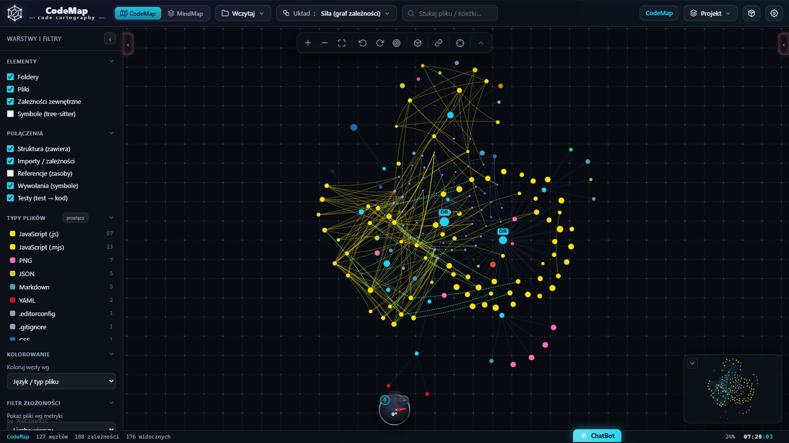
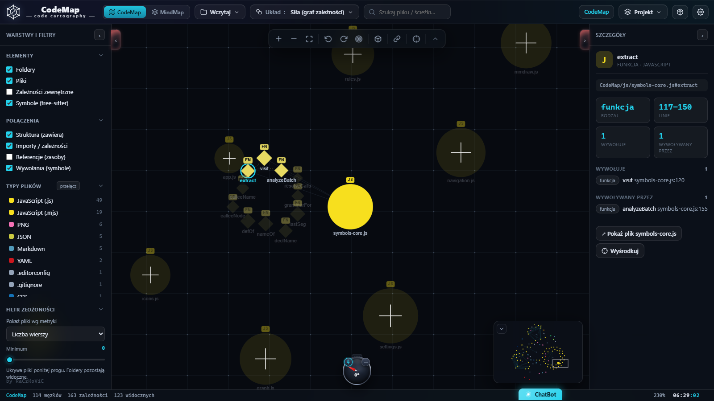
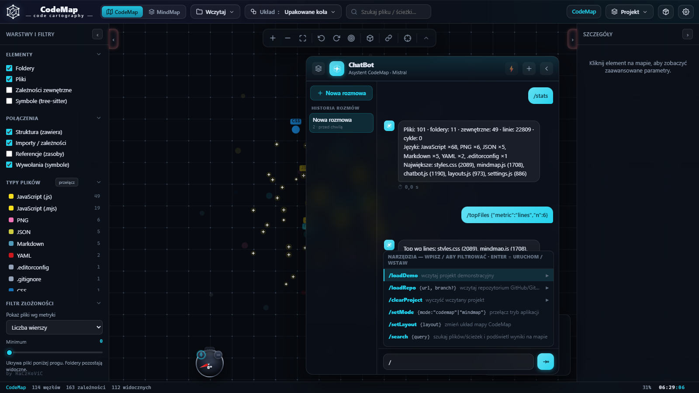
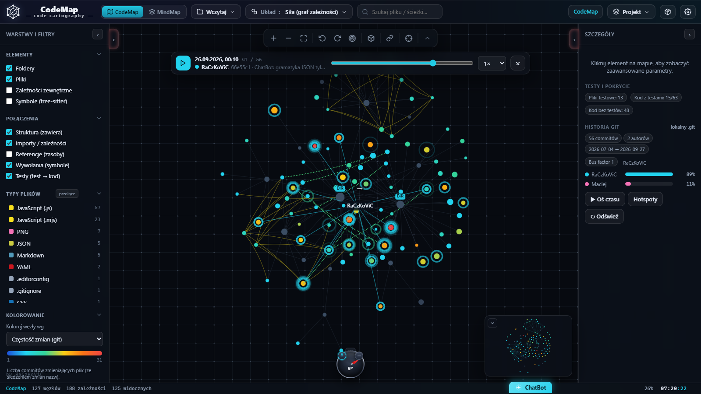

# CodeMap — Code Cartography 🗺️

**English** · [Polski](README.pl.md)

[](LICENSE)
[](https://github.com/RaCzKoViC/CodeMap/releases)
[](https://github.com/RaCzKoViC/CodeMap/actions/workflows/deploy-pages.yml)
[](#-architecture)

CodeMap is a local-first, Maltego-style code cartography tool. Load a folder, an archive or a GitHub /
GitLab / Bitbucket repository and get an interactive map of files, dependencies and metrics — together with
git history, tests and coverage, static analysis, PR impact maps and optional AI assistants that can run
**entirely in your browser** (WebLLM) or on your own machine (Ollama). Pure JavaScript, no build step,
installable PWA, MIT-licensed. The UI is available in English and Polish.

**Live demo:** https://raczkovic.github.io/CodeMap/#demo



| Symbol and call graph (tree-sitter) | ChatBot controlling the map, `/` tools menu |
|:---:|:---:|
| [](docs/screenshot-symbols.png) | [](docs/screenshot-chatbot.png) |

| Git history from the local `.git`: change frequency, timeline, authors, tests ↔ code |
|:---:|
| [](docs/screenshot-git.png) |

<sub>The screenshots show the CodeMap repository itself loaded as a project; `node tools/screenshots.mjs` regenerates them.</sub>

---

## 🚀 Up and running in 30 seconds

```bash
git clone https://github.com/RaCzKoViC/CodeMap.git
cd CodeMap
python serve.py            # → http://localhost:8777
```

No Python? Any static server will do (`npx serve .`), or simply double-click `index.html`
(`file://` mode has limitations: no service worker and no snapshots in IndexedDB).
Click **“✨ See demo”** or open `index.html#demo`.

---

## ✨ Features

### Loading (150+ formats)
- **Folder / files / drag and drop / paste** (`Ctrl+V`) — the full directory structure.
- **Live folder** (Load → Live folder, Chrome / Edge): the map keeps up with your edits — changed files are
  re-read and re-analysed in a Web Worker, positions, selection, camera and colouring stay put, changes glow on
  the map, a new commit refreshes the git history. Secrets (`.env`, private keys) are shown but never read.
  After a page reload the status bar offers **↻ Resume live: <folder>** — one click (the browser asks for read
  permission again) and the folder is loaded and watched again, unchanged files straight from the analysis cache.
- **Example repositories** (Examples on the start screen, Load → *Example repositories…*): nine small real projects
  in seven languages (Express, Preact, ky, petite-vue, Flask, Gin, serde json, Gson, Rake), opened with one click —
  optionally straight into a code tour.
- **Archives** — ZIP, TAR, TGZ, GZ — unpacked right in the browser (`DecompressionStream`).
- **PDF** — a map built from bookmarks and pages.
- **Repositories** from GitHub, GitLab and Bitbucket by URL (public, or private with a token), with branch/tag
  and subdirectory selection, **comparison of two branches** by tree signature, and map export to a Gist.
- **Links**: `#repo=owner/name[@branch[/subdir]]` (a full GitHub/GitLab/Bitbucket URL works too, plus `&layout=`),
  `#gist=<id>` (a map exported to a Gist), `#share=<id>` (a public link from the backend), `#v=` (the current view).
  Example: [`#repo=RaCzKoViC/CodeMap@main/server&layout=treemap`](https://raczkovic.github.io/CodeMap/#repo=RaCzKoViC/CodeMap@main/server&layout=treemap).

### Analysis
- Per-file metrics: lines, code, comments, complexity, functions, TODO/FIXME, size, date.
- Import parsing for 19 language families (JS/TS, Python, C/C++, Go, Java, C#, PHP, Ruby, Rust, Swift, Dart, Elixir, Lua, Zig, Haskell, Shell, CSS/SCSS,
  HTML, Markdown), per-directory `tsconfig`/`jsconfig` aliases with `extends`, monorepo workspaces, dynamic
  references (`new Worker`, `import.meta.glob`…), and external dependencies as separate nodes.
- Symbols (functions, classes, types) with their own complexity in the details panel.
- **Symbol and call graph (tree-sitter)** — optional: functions, methods, classes, structs, interfaces,
  enums and traits become second-level nodes under their file, and calls resolved within the file and through
  imports become edges. 12 grammars (JS/JSX, TS/TSX, Python, Go, Java, Rust, C, C++, C#, PHP, Ruby), parsed
  in a Web Worker; double-click a file to expand its symbols — while files are collapsed, calls connect the files.
- Graph: neighbors, upstream and downstream **dependency impact**, **cycles** (Tarjan SCC), signatures for comparisons.

### Map
- **13 layouts**: packed circles, structure tree, radial tree, treemap, icicle, sunburst, force,
  dependency layers, modules, arc diagram, galaxy, nebula, rings.
- Force-directed physics runs in a **Web Worker**, so the UI doesn't freeze on large repositories (auto-LOD, node budget).
- **GPU rendering (WebGL2)** for large maps: from 3,000 visible nodes + edges the background, grid, all edges (arcs, dashes,
  impact and cycle overlays) and all shapes are drawn by the GPU, with labels and selection on a 2D layer on top.
  20,000 files with 60,000 edges: ~1–2 ms per frame instead of 30–150 ms on canvas 2D; dense edges fade by their
  on-screen density instead of being dropped. Left panel → Map → *Map rendering* (automatic / Canvas 2D / WebGL);
  without WebGL2 the canvas stays. `npm run bench` measures both on synthetic projects (also in CI).
- **Fast reloads:** files are analysed in up to 4 Web Workers in parallel, and the results are cached in the browser
  (OPFS, gzip, per project). Reloading the same folder or repository skips unchanged files — same size and modification
  time (or git blob sha), otherwise the content hash decides: 2,800 files load in ~0.2 s instead of ~2.6 s. Only metrics,
  imports and symbol names are stored; Settings → Installation → *Clear analysis cache*.
- Pan, zoom to cursor, **rotation**, pseudo-3D, minimap, neighborhood radar, `WASD` fly mode, impact view,
  code preview on hover, context menu, command palette (`Ctrl+K`), search (`/`).
- **PNG** (2×/4×) and **SVG** export, link to the current view (`#v=`).

### Tracking how the project evolves
- **Snapshots** (IndexedDB) and **history**: an added / changed / removed report, Δ lines and size,
  with the differences drawn on the map (green / yellow / red).
- **Save / load** the whole map including positions (`.codemap.json`), compare several schemas side by side,
  hotspots (size × dependencies × complexity).

### Git history
- A folder loaded **together with its `.git` directory** is analyzed right away — in the browser, in a Web Worker,
  with no network access (the git object, pack and delta reader is written from scratch). For a repository from
  GitHub / GitLab / Bitbucket: Project → **Git history** (uses the host's API; without a token, changed files
  are fetched for the ~50 newest commits).
- The **owner** of every file and each author's share, the **bus factor** of the project and of every folder,
  renames followed back through history, bots ignored when assigning ownership; owner avatars on the nodes.
- **Churn × complexity hotspots** — files that change often and are complex at the same time (as in CodeScene).
- **Coloring** of nodes (left panel): owner, change frequency, hotspots, last change — alongside
  language, complexity and modification date; a legend with counts, and clicking an entry highlights its files.
- **Timeline** — an animated evolution of the project (Gource-lite): files appear in the order they were
  created and changes glow in the author's color; without git history, the timeline is built from snapshots.
- Inspect: the **Change hotspots** and **Knowledge in one head** rules (≥ 90 % of a complex file's changes come from one person).

### Tests and coverage
- CodeMap links **tests to the code they test** on its own — by name (including mirrored paths `test/` ↔ `src/`,
  `src/test/java` ↔ `src/main/java`) and by imports, for over a dozen languages; shown as “Tests (test → code)” edges.
- **Coverage** from lcov, Istanbul (`coverage-final.json`, `coverage-summary.json`), Cobertura, JaCoCo and Clover —
  picked up automatically from `coverage/` in the loaded folder, loaded from Project → “Load test coverage”, or
  dropped onto the map. “Test coverage” and “Tests” colorings, a “Tests and coverage” section
  in the details panel, uncovered lines in the file preview, and the Inspect rules “Complex files without tests” and “Low test coverage”.

### Inspect — static analysis
16 anti-pattern rules (cycles, god-files, hubs, orphans, complexity, risky APIs, empty `catch` blocks, debug leftovers,
deep nesting, minified files, **duplicated code** — winnowing over file contents…) with statistical
thresholds, a **health score** and a Markdown report. An optional **`.codemap.rules.json`** file in the repository
(layers = path globs, `forbid` between layers, `noCycles`) is enforced as the
“Architecture rule violations” rule. In the details panel every file and folder shows its **coupling** — Ca / Ce / I
(afferent, efferent, Martin's instability). The visible graph can be **exported** to DOT (Graphviz),
Mermaid and GraphML (yEd) — from the Project menu or with the ChatBot action `exportGraph`.

### AI — optional and privacy-preserving
- **WebLLM** — models that run in the browser (WebGPU), with weights cached and nothing sent anywhere.
- **Ollama** — a local model server on your own computer.
- **API keys (cloud)** — as many keys as you like: Mistral, OpenAI, Anthropic (Claude), Google Gemini, Groq,
  OpenRouter, DeepSeek, xAI, Together. The provider is **detected from the key format** and confirmed with the
  **Test** button (which fetches the model list); the model is chosen per key, and working keys are used in rotation.
- **ChatBot** controls the app (about 50 actions: layout, filters, theme, search, snapshots…). Anything outside
  the “view-only” set needs a click — the model can't load, delete or export anything on its own.
- Type **`/`** in the chat box to see every tool (stats, top files, content search,
  dependencies, export…); drag an element from the map into the chat window to attach it to your question (up to 30).
  The chat window can be moved and resized, and the conversation list has an adjustable width.
- Reasoning models (DeepSeek R1, Qwen 3) show their reasoning trace in a collapsible panel; the ⚡ button gives
  a **Quick answer** without reasoning.
  Local models (WebLLM, Ollama) answer in **structured mode**: JSON `{reply, actions}` enforced by a
  schema, so even small models carry out commands reliably.
- **Code questions (RAG, 📚 mode)** — a toggle in the chat header: ChatBot answers from
  snippets of the loaded project's code and cites them as `[1]`, `[2]` (click = the file opens at those lines).
  Keyword search works out of the box (identifiers are split apart, Polish questions are expanded with English
  terms); an embedding model in Ollama (`bge-m3`, `nomic-embed-text`) or 🌐 **in the browser** (WebLLM
  `snowflake-arctic-embed`, WebGPU, no Ollama needed) adds semantic search —
  the index is built in Settings → AI, and the vectors are stored in the browser and recomputed only for changed
  snippets. The `/codeSearch` tool shows matches without any model.
- **Agent with tools (Ollama, 📚 mode)** — when the snippets are not enough, the model looks things up itself
  before answering: `codeSearch`, `readFile`, `findFiles`, `dependencies`, `dependents`, `fileInfo`,
  `hotspots`, `owners` (git), `tests` — all read-only, running in the browser on the loaded project — plus
  `showOnMap`, which highlights the files the answer is about and moves the camera to them. Works with native tool calls
  (Llama 3.x, Qwen 3) and with models that write the call as JSON in the text (Qwen 2.5 Coder); tool results are
  cited as `[n]` like the snippets, and the steps are shown in a collapsible "Agent steps" list. Up to 5 steps,
  then the model has to answer. A file named in the question (`agent.js`) is always included in the context.
  Can be switched off in Settings → AI → Ollama.
- **🩺 Hotspot doctor** — a refactoring plan for one risky file: the file panel shows its risk rank and a
  *Refactoring plan* button (or `/hotspotDoctor`, by default the top hotspot). The model gets a record of the file —
  size, complexity, git changes and owners, tests and coverage, dependent files — and numbered excerpts of its longest
  functions, and answers in four fixed sections: diagnosis, 3–5 small steps citing the code `[n]`, tests to add before
  the change, risk. Local models only (the code never leaves your computer).
- **🧭 Code tours** (Project → *Code tour…*) — an ordered path through the files with a note per step, for someone
  new to the project: created automatically from the map (overview → entry points → core modules the most files
  depend on → hotspot → tests) or planned by a model from the **structure only** (paths, metrics, dependencies, symbol
  names — so cloud models work too). Played on the map: a step card, numbered steps with arrows, ← / → / Esc; notes
  are editable, the tour is saved with the map, shared as a link (`#tour=…`, alone or with `#repo=`), and exported /
  imported as **VS Code CodeTour** (`.tour`).
- **Runner** — a sandbox for running generated HTML/SVG/CSS/JS/PHP: `runner.html` hosts the code in a nested
  `iframe sandbox` without `allow-same-origin`, so it cannot touch the app even though the app enforces a strict CSP.
- Cloud models only ever receive the project's **structure** (names, numbers), never file contents; code
  snippets (📚 mode, attachment previews) go to **local** models only — WebLLM and Ollama.

### MindMap
A second working mode: 16 frame templates, **34 diagram types**, a drawing layer with 9 tools
(hand-drawn style), undo/redo, Markdown import/export, and a snapshot timeline.

### Drive & Vault
- **Vault** — password-encrypted storage in OPFS (AES-GCM-256, PBKDF2), a photo gallery and a “Favorites” album.
- **Drive** — a real folder on your computer through the File System Access API (with a persistent handle).

### Interface
English and Polish, dark/light theme, 8 color presets, “liquid glass” appearance sliders,
an interactive tutorial (CodeMap and MindMap), a built-in user manual, and an installable PWA.

### PR review — impact map
- Project → **PR review — impact map…** (a PR / MR number or URL from GitHub, GitLab or Bitbucket) or the link
  `#repo=owner/name&pr=N`: changed files (A/M/D/R markers on the nodes), the files that depend on them, and the
  **risk of each change** (0–100) based on change frequency, complexity, number of dependents, tests / coverage,
  change size and whether the author knows the file; suggested reviewers from git history; a “PR impact” coloring; a Markdown report.
- The same in CI: the CLI's `--base` / `--baseline` / `--pr-md` options and a PR comment from the GitHub Action
  (health score before and after, new findings, a `max-score-drop` threshold) — see [docs/github-action.md](docs/github-action.md) (in Polish).

### CLI and CI
- `node cli/codemap.mjs analyze [path]` (or `npm link` → `codemap`) — the same analysis as the “Static
  analysis” panel, with no browser and no npm dependencies: git history from `.git`, tests and coverage, architecture rules.
- Reports: terminal, `--json`, `--md`, `--sarif` (GitHub code scanning), `--map` (a map to open in the app),
  `--export dot|mermaid|graphml`. CI thresholds: `--min-score`, `--fail-on cycles,archviolation|high`,
  `--max-findings` (exit codes 0 / 1 / 2); change review: `--base <ref>`, `--baseline`, `--pr-md`,
  `--max-score-drop`.
- npm package (not published yet — the name `codemap` is taken, so it goes under a scope): `npm run npm-pack -- --name @scope/codemap`
  builds a 170 KB package (CLI + 17 analysis modules), installs it in a temp dir and runs the installed `codemap analyze`;
  then `npm publish dist/npm/<file>.tgz --access public` and `npx @scope/codemap analyze .`.
- **GitHub Action**: `uses: RaCzKoViC/CodeMap@v1.2.0` — a report in the step summary, SARIF, thresholds; an example
  with code scanning is in [docs/github-action.md](docs/github-action.md) (in Polish). The same step runs in this repository's CI.

### VS Code extension
`integrations/vscode/` — the same analysis inside the editor: Inspect findings in **Problems** (line, rule,
related files), the health score in the status bar, CodeLens above git hotspots, the CodeMap map in a panel
with navigation both ways (file ↔ node), analysis on save. Runs locally in a worker thread, no network.
Install: `cd integrations/vscode && npm run package` → `code --install-extension codemap-0.1.0.vsix`
(requires VS Code ≥ 1.90).

---

## ⌨️ Keyboard shortcuts

| Key | Action | | Key | Action |
|---|---|---|---|---|
| `F` | fit view | | `Q` / `E` | rotate left / right |
| `+` / `-` | zoom in / out | | `R` | reset rotation |
| `/` | search | | `T` | perspective (pseudo-3D) |
| `Ctrl+K` | command palette | | `Alt+S` | shortcuts cheatsheet |
| `Esc` | deselect / close | | `WASD` + `Space` | fly mode |

Mouse: drag the background = pan • wheel = zoom • `Shift`+drag or right-drag = rotate •
double-click a folder = collapse/expand • right-click = context menu.

---

## 🔒 Privacy — what leaves your device

By default, **nothing**. Analysis, the map, snapshots, the Vault and history all live in your browser. The network is
used only when you explicitly ask for it:

| When | Where to | What |
|---|---|---|
| loading a repository | api.github.com / gitlab.com / api.bitbucket.org | the repository address, an optional token (kept only in the tab's memory) |
| Git history of a repository loaded from a URL — on request | the same APIs + avatars.githubusercontent.com | requests for the commit list and changed files; author avatars. A local `.git` is read only inside the browser |
| API key (cloud) | the chosen provider's API (api.mistral.ai, api.openai.com, api.anthropic.com, …) | your key and the project structure (names, numbers) |
| WebLLM | esm.run, huggingface.co | downloading the library and model weights; inference runs locally |
| PHP Runner | cdn.jsdelivr.net | downloading the php-wasm interpreter |
| Symbols (tree-sitter) — once enabled | cdn.jsdelivr.net | downloading the web-tree-sitter parser and WASM grammars; parsing runs locally in a Web Worker |
| Ollama | 127.0.0.1:11434 | local — including code snippets in 📚 mode and their embeddings (RAG) |
| account (optional) | your own server | maps, snapshots, settings; the Vault **only as ciphertext** |
| opening a `#repo=` / `#gist=` link | the same APIs as loading a repository; api.github.com and gist.githubusercontent.com | the repository address / gist id, **without a token** |
| public map link — when logged in, on request | your server, then **anyone who has the link** | a copy of the map: file names and paths, metrics, dependencies; file content previews and author e-mails only if you untick those options; until it expires or is revoked |

API keys are stored in the browser's `localStorage` and are never synced to the server.
Details and how to report a vulnerability: [SECURITY.md](SECURITY.md) (in Polish).

---

## 🧱 Architecture

Pure JavaScript, with no dependencies and no build step. The modules are global `CM.*` objects
loaded in order from `index.html`.

```
index.html                 # UI structure
css/styles.css             # "cyber-cartography" theme (dark / light)
js/util.js                 # camera (pan/zoom/rotate/tilt), utilities, CM.VERSION
js/icons.js  js/i18n.js    # SVG icons, PL/EN translations
js/languages.js            # registry of 150+ formats
js/analysis.js             # metrics, import parsing, dependency resolution
js/analysis-worker.js      # file analysis (metrics, imports, symbols) in up to 4 Web Workers
js/analysis-cache.js       # analysis cache in OPFS: unchanged files (size + mtime / git blob sha, else content hash) are not re-analysed
js/symbols-core.js  js/symbols.js  js/symbols-worker.js   # symbol graph: tree-sitter in a worker
js/graph.js                # model: hierarchy, aggregates, collapsing, cycles, impact, (de)serialization, diff
js/layouts.js              # 13 layouts (+ physics), js/sim-worker.js — Web Worker
js/export.js               # export of the visible graph: DOT (Graphviz), Mermaid, GraphML (yEd)
js/metrics.js              # Ca/Ce/I coupling per file and folder, duplicated code (winnowing)
js/rules.js                # architecture rules from .codemap.rules.json (layers, forbid, noCycles)
js/git-core.js             # DOM-free git history: authors, ownership, bus factor, hotspots, timeline
js/git-local.js  js/git-worker.js   # local .git reader (objects, packs, deltas, packed-refs) in a Web Worker
js/rag.js                  # RAG: code snippets by symbol, BM25 + Ollama embeddings (IndexedDB), context with citations
js/agent.js                # agent loop: read-only tools (codeSearch, readFile, dependents…), native tool_calls or JSON in text
js/doctor.js  js/doctor-ui.js   # hotspot doctor: file record + prompt (pure), file-panel section and hotspotDoctor action
js/tour.js  js/tour-ui.js       # code tours: automatic / model-planned from structure, CodeTour, #tour= links; player on the map
js/testmap.js              # tests ↔ code, coverage parsers (lcov / Istanbul / Cobertura / JaCoCo / Clover)
js/renderer.js             # canvas: drawing, hit-testing, interaction, minimap, module decorators
js/gl-layer.js             # WebGL2 layer under the map: edges and shapes on the GPU (instanced, camera as a uniform)
js/overlays.js             # node coloring by data (language, complexity, git, coverage) + legend
js/loaders.js              # folder / files / archives / PDF / GitHub / GitLab / Bitbucket / Mistral; side files (.git, lcov)
js/git-remote.js           # commit history from the GitHub / GitLab / Bitbucket APIs
js/storage.js              # snapshots and session (IndexedDB)
js/ui.js                   # details panels, filters, history, diff
js/settings.js             # settings window: tab registry, general tabs, interactive tutorial
js/settings-strings.js     # settings and tutorial texts (PL / EN)
js/settings-ai.js          # AI tab: providers, API keys, WebLLM, Ollama, code index (RAG)
js/settings-docs.js        # built-in specification and user manual
js/inspect.js              # static analysis (16 rules + architecture rules, health score)
js/localai.js  js/ollama.js  js/chatbot.js  js/runner.js   # AI: WebLLM, Ollama, ChatBot, sandbox
js/mindmap.js  js/mmdraw.js  # MindMap mode + drawing layer
js/drive.js                # Drive (File System Access) and Vault (OPFS + AES-GCM)
js/auth.js  js/sync.js     # account and sync (backend only)
js/app-core.js             # CM.App — shared context (graph, renderer, state, filters, handlers) + core:
                           #   init/boot, apply, ingest, loadFromJSON, clearAll, selection, session, modes, worker
js/chrome.js               # DOM wiring: toolbar, menus, panels, appearance/settings, filters, search, DnD, keyboard, PWA
js/repo-hosts.js           # GitHub/GitLab/Bitbucket: authors, deep links, branches, gist, shareable view (#v=)
js/compare.js              # schema comparison, cycles, snapshot history and diff, hotspots/Inspect
js/navigation.js           # neighborhood radar, minimap, rotation dial, WASD navigation, context menu, image export
js/ai-bridge.js            # AI (Mistral/local), ChatBot bridge (appState/exec, registerAction), Ctrl+K palette, demo data
js/git.js                  # git history on the map: running, overlays, panel, avatars, timeline, ChatBot actions
js/pr-core.js  js/pr.js    # PR impact map: change risk, dependents, reviewers (DOM-free) + dialog, overlay, panel
js/tests-ui.js             # tests and coverage in the app: overlays, panel, Inspect, ChatBot, report loading
js/deeplink.js  js/links.js  # #repo= / #gist= / #share= links (validation, loading), public links dialog
js/app.js                  # bootstrap: CM.App.boot() + window.CMApp (API for chatbot/drive/inspect/smoke)
js/vscode-bridge.js        # bridge to the VS Code extension (does nothing outside its webview)
integrations/vscode/       # VS Code extension: diagnostics, status bar, CodeLens, map panel
cli/                       # headless CLI (vm runtime with the same js/*.js, analysis, SARIF, reports); action.yml — GitHub Action
sw.js  manifest.webmanifest  serve.py                       # PWA and local server
```

The modules from `app-core` to `ai-bridge` share a single `CM.App` context (`A`): each one adds its functions with
`Object.assign(A, …)` and calls the others only at run time through `A.name(…)`, so apart from
`app-core.js` loading first (it creates `CM.App`) and `app.js` last, their order doesn't matter.
`A.graph` is replaced on every load — modules read it at call time instead of keeping a copy.

Roadmap and known technical debt: [docs/ROADMAP.md](docs/ROADMAP.md) (in Polish).

---

## ☁️ Account and sync (optional backend)

The `server/` directory contains a small server (Node.js ≥ 20.6, Fastify, SQLite) that adds accounts with e-mail
verification and syncing of maps, snapshots, settings and the Vault — the Vault **only as ciphertext**
(client-side AES-GCM; the server never sees passwords or content). Without logging in, the app works
100 % locally. Without a backend, the **Account** button is hidden. A logged-in user can create a **public
map link** (Project → “Share a public link…”, `#share=<id>`) with an expiry time, and revoke it
in Settings → Account; file content previews are left out by default. Backend tests: `cd server; npm test`.

```powershell
cd server; copy .env.example .env; npm install; npm start   # → http://localhost:8787 (frontend + API)
```

In development, e-mails are printed to the console (`EMAIL_MODE=console`). The dev server listens only on
`127.0.0.1` and serves nothing but the frontend files. Production (Caddy + systemd + backups):
[`deploy/setup-vps.md`](deploy/setup-vps.md) (in Polish); upload with `.\tools\deploy.ps1 -Server deploy@your-domain`.

---

## 🤝 Contributing

Bug reports and ideas: [Issues](https://github.com/RaCzKoViC/CodeMap/issues).
The rules that keep the project simple:

- no build step and no npm dependencies on the frontend — new libraries are only loaded on demand;
- every UI string goes through `CM.i18n.t()` with both a PL **and** an EN translation;
- a change to files in `js/` or `css/` = bump `?v=` in `index.html` and `CACHE` in `sw.js`;
- edit `index.html` with a tool that preserves UTF-8;
- before committing, run `npm run verify` (tests, lint, grammar probe, a `.git` probe checked against `git log`) and `node tools/smoke.mjs` (headless Chrome);
  after visual changes, `node tools/screenshots.mjs` refreshes the screenshots in `docs/`.

Changelog: [CHANGELOG.md](CHANGELOG.md) (in Polish).

---

## 📜 License

CodeMap is **open source** under the [MIT](LICENSE) license — you may use, copy, modify
and distribute it (commercially too), as long as the copyright notice is kept.

Libraries loaded on demand: [WebLLM](https://github.com/mlc-ai/web-llm) (Apache-2.0),
[rough.js](https://github.com/rough-stuff/rough) (MIT), [php-wasm](https://github.com/seanmorris/php-wasm) (Apache-2.0).
Backend: Fastify, better-sqlite3, argon2 (MIT).
